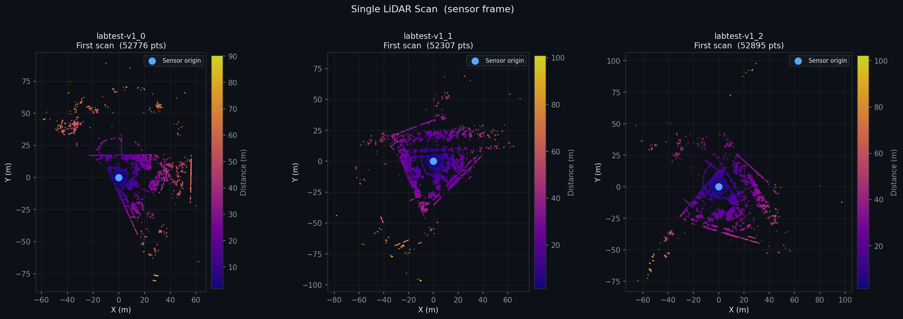
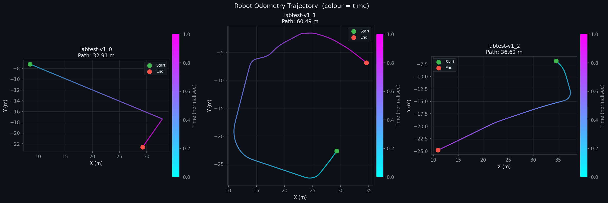
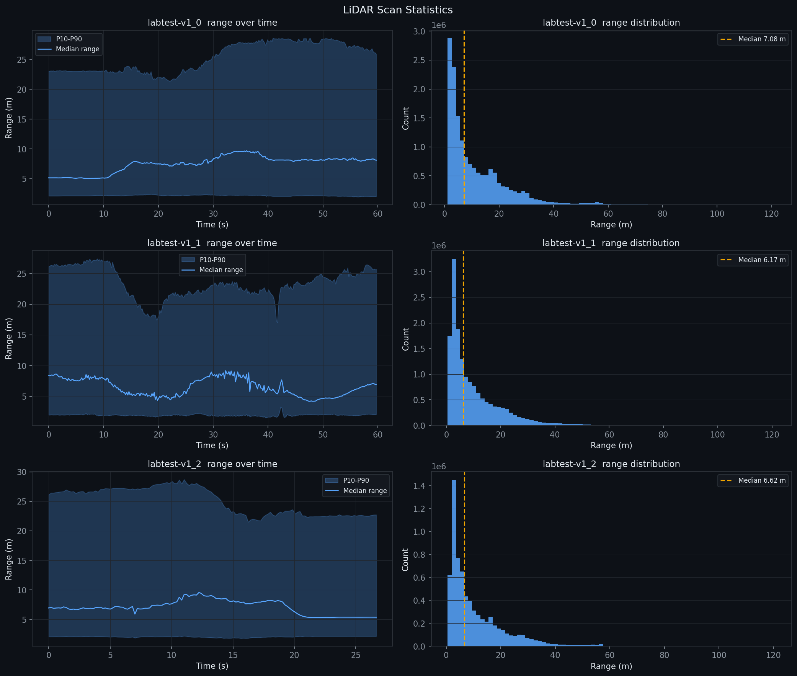
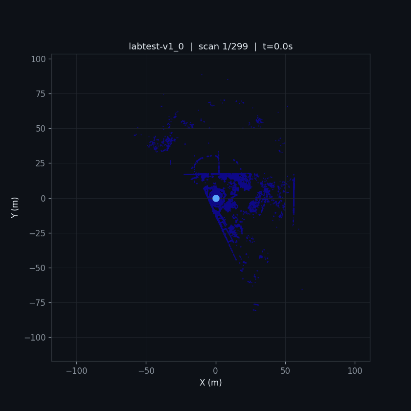
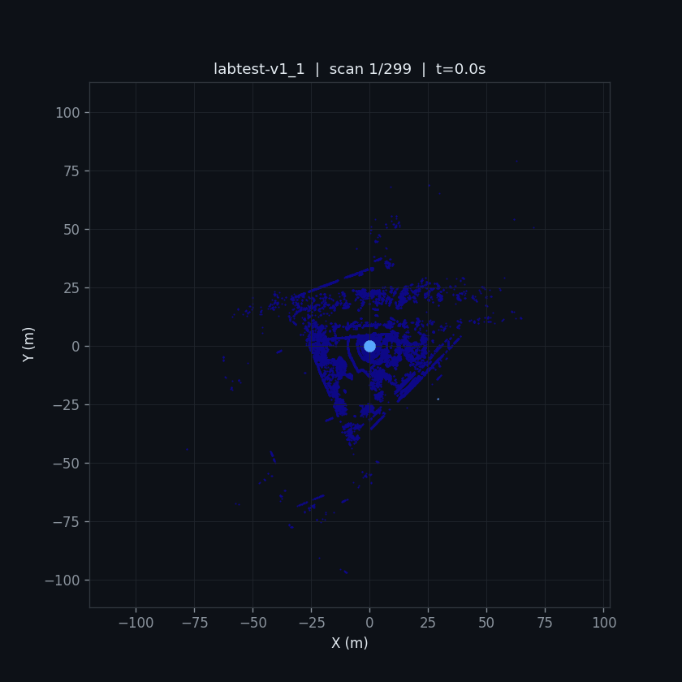
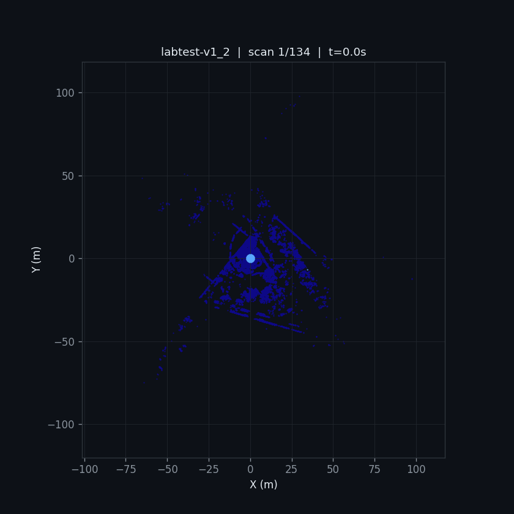
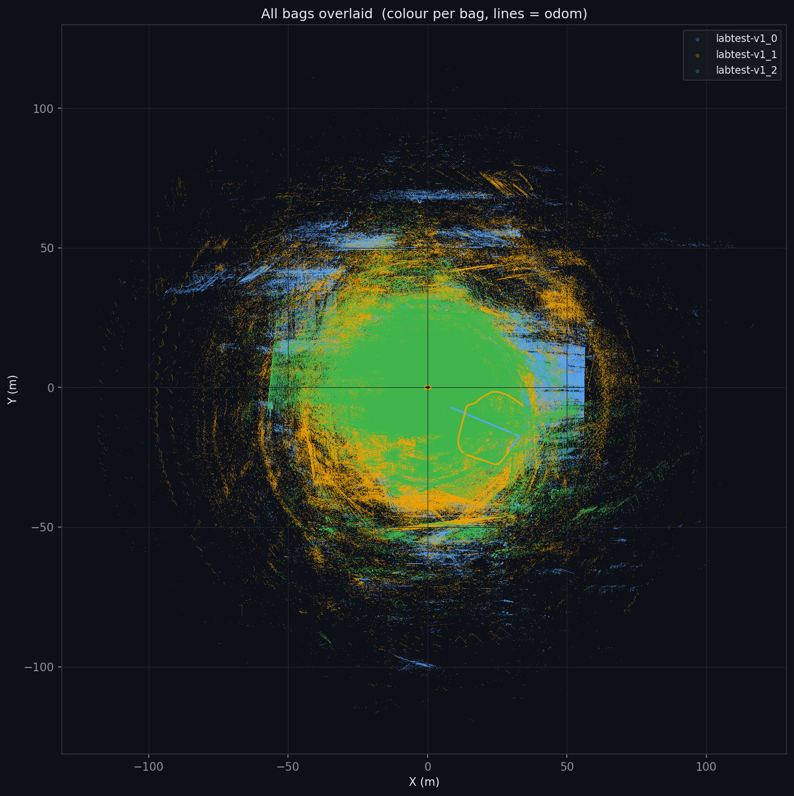

# 🤖 ROS Bag LiDAR 2D Visualizer
### ELTE Robot — `labtest-v1` Bag Files

A self-contained **Google Colab notebook** that downloads ROS 1 bag files directly from a Nextcloud share, then produces a full suite of 2D LiDAR visualizations — no manual downloading required. Just open the notebook and run all cells.

---

## ✨ Features

| Output | Description |
|--------|-------------|
| **Plot A** — Single scan | First LiDAR sweep coloured by distance |
| **Plot B** — Composite map | All scans accumulated, colour = time, with odometry overlay |
| **Plot C** — Occupancy grid | Gaussian-smoothed 2D density heatmap at 5 cm resolution |
| **Plot D** — Odometry trajectory | Robot path coloured by elapsed time |
| **Plot E** — Scan statistics | Median / P10–P90 range over time + range histogram |
| **Anim** — Animated GIF | Per-scan sweep with ghost trail |
| **Plot G** — All-bags comparison | All three recordings overlaid in one map |

All outputs are packed into a single `lidar_visualizations.zip` and auto-downloaded at the end.

---

## 🚀 Quick Start

1. Open the notebook in Google Colab.
2. Run **all cells** top to bottom — dependencies install automatically and bag files are fetched via WebDAV.
3. At the end, `lidar_visualizations.zip` is downloaded to your machine.

> **Requirements:** a Colab runtime (CPU is fine). No local environment setup needed.

---

## 🗂 Notebook Structure

### Cell 1 — Install dependencies
```bash
pip install rosbags numpy matplotlib scipy tqdm ipywidgets requests
```
Installs all required packages silently with `-q`.

---

### Cell 2 — Download bag files from Nextcloud

Authenticates against the Nextcloud WebDAV endpoint using the public share token, lists `.bag` files via `PROPFIND`, then streams each file to `/content/bags/`. Already-downloaded files are skipped (idempotent).

```
SHARE_URL = 'https://nc.elte.hu/s/JC2Hw7MidkZRXWJ'
WebDAV    → https://nc.elte.hu/public.php/webdav/
Auth      → (share_token, '')
```

Falls back to HTML scraping if WebDAV returns a non-207 status.

---

### Cell 3 — Inspect bag topics

Opens each bag with `rosbags` and prints a topic/message-type/count table so you can verify the data before processing.

---

### Cell 4 — Auto-detect topics

Scans a list of common LiDAR (`/scan`, `/velodyne_points`, …) and odometry (`/odom`, `/odometry/filtered`, …) topic names and selects the first match found in the bag.

---

### Cell 5 — Parse all messages

Iterates over every bag, deserializing:
- **`sensor_msgs/LaserScan`** → polar-to-Cartesian conversion
- **`sensor_msgs/PointCloud2`** → XY extraction from binary blob
- **`nav_msgs/Odometry`** → position + yaw from quaternion

Results are stored in `all_bags_data[bag_stem]` as `{'scans': [...], 'odom': [...]}`.

---

### Plot A — Single LiDAR Scan

The very first scan from each bag, coloured by Euclidean distance from the sensor origin.



---

### Plot B — Composite LiDAR Map

Every scan in the recording is drawn on a single canvas. Colour encodes time (early = dark, late = bright). The odometry path is overlaid in blue with start/end markers.

> *Plots B and C were rendered but appear blank in the uploaded previews — see the notebook output for the full maps.*

---

### Plot C — 2D Occupancy Density Map

A grid of 5 cm × 5 cm cells is built by binning all LiDAR returns. Hit counts are log-scaled and Gaussian-blurred (σ = 0.7 cells) then rendered with the `inferno` colormap.

---

### Plot D — Odometry Trajectory

Each recording's robot path is drawn as a `LineCollection` coloured cyan→magenta by normalised time, with path length annotated in the title.



| Bag | Path length |
|-----|-------------|
| `labtest-v1_0` | 32.91 m |
| `labtest-v1_1` | 60.49 m |
| `labtest-v1_2` | 36.62 m |

---

### Plot E — LiDAR Scan Statistics

For each recording: median range and P10–P90 band over time (left), plus the full range histogram with median annotated (right).



| Bag | Median range |
|-----|-------------|
| `labtest-v1_0` | 7.08 m |
| `labtest-v1_1` | 6.17 m |
| `labtest-v1_2` | 6.62 m |

---

### Animated GIFs — Per-Scan Sweep

Each bag produces a GIF showing up to 60 keyframes. A ghost trail of the 8 most recent scans fades in behind the current frame, and the odometry path grows incrementally.

**labtest-v1_0** (299 scans, ~60 s)



**labtest-v1_1** (299 scans, ~60 s)



**labtest-v1_2** (134 scans, ~27 s)



---

### Plot G — All Bags Overlaid

All three recordings drawn in the same coordinate frame (blue / orange / green), letting you compare coverage and robot paths at a glance.



---

## 📊 Summary Statistics

| Bag | Scans | Duration | Total pts | Pts/scan | Median range | Odom path |
|-----|------:|--------:|----------:|---------:|-------------:|----------:|
| `labtest-v1_0` | 299 | ~60 s | ~15.8 M | ~52 776 | 7.08 m | 32.91 m |
| `labtest-v1_1` | 299 | ~60 s | ~15.6 M | ~52 307 | 6.17 m | 60.49 m |
| `labtest-v1_2` | 134 | ~27 s | ~7.1 M | ~52 895 | 6.62 m | 36.62 m |

---

## 🔧 Configuration

All key parameters are defined near the top of the relevant cells:

| Variable | Default | Purpose |
|----------|---------|---------|
| `SHARE_URL` | Nextcloud link | Source of bag files |
| `LIDAR_TOPIC` | `/scan` | Auto-detected, can be overridden |
| `ODOM_TOPIC` | `/odom` | Auto-detected, can be overridden |
| `GRID_RES` | `0.05` m | Occupancy grid cell size |
| `ANIM_FRAMES` | `60` | Max keyframes per GIF |
| `ANIM_INTERVAL` | `80` ms | Frame delay (~12.5 fps) |
| `TRAIL_FRAMES` | `8` | Ghost trail length in animation |

---

## 📦 Output Files

```
lidar_visualizations.zip
├── plot_A_single_scan.png
├── plot_B_composite_map.png
├── plot_C_occupancy_grid.png
├── plot_D_odom_trajectory.png
├── plot_E_scan_stats.png
├── plot_G_comparison.png
├── anim_labtest-v1_0.gif
├── anim_labtest-v1_1.gif
└── anim_labtest-v1_2.gif
```

---

## 📚 Dependencies

| Package | Purpose |
|---------|---------|
| `rosbags` | Read ROS 1 `.bag` files without a ROS installation |
| `numpy` | Numerical array operations |
| `matplotlib` | All plotting and animation |
| `scipy` | Gaussian blur for occupancy grid |
| `tqdm` | Progress bars |
| `requests` | WebDAV download |

---

## 📄 License

MIT — feel free to adapt for your own ROS bag datasets.
